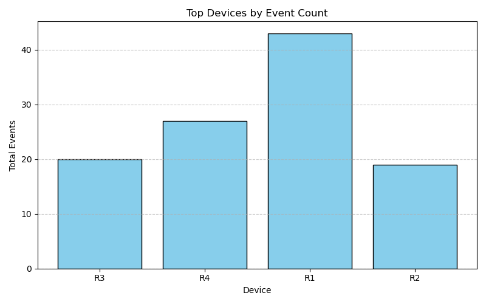
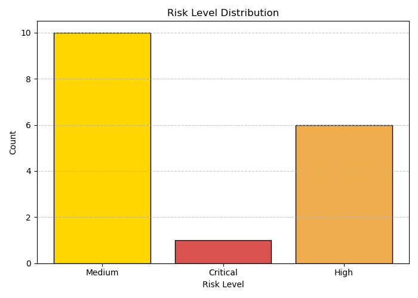

# Task 1: Advanced Network Log Analyzer

## Overview
A Python tool that converts raw network syslog files into structured analytics, detects operational risks (Interface Flaps, BGP Instability, CPU Spikes, Thermal Alarms, SNMP Auth Failures), and exports structured output into SQLite, CSVs, and visualization charts.

---

```text
task-1-log-analyzer/
├── analyzer.py            # Main processing & parsing script
├── requirements.txt       # Project dependencies
├── README.md              # Project documentation
├── logs/                  # Raw input log files directory
├── output/                # Generated reports folder
│   ├── events.csv         # Extracted and structured security events
│   └── risk_report.csv    # Aggregated risk analysis report
└── network_events.db      # Local SQLite database (auto-generated)
```

---

## 🛠️ Requirements & Installation
- Python 3.x
- `matplotlib` (Required for bonus chart generation)

Install dependencies on Ubuntu/Debian:
```bash
sudo apt update && sudo apt install python3-matplotlib -y
```

---

## 🚀 How to Run

### 1. Standard Execution
Parses all log files inside the `logs/` directory, updates SQLite, exports CSVs, and updates charts:
```bash
python3 analyzer.py
```

### 2. CLI Filtering Examples
```bash
# Filter by device name
python3 analyzer.py --device R1

# Filter by risk severity
python3 analyzer.py --risk-level Critical

# Filter by event category
python3 analyzer.py --category Interface

# Filter by syslog severity
python3 analyzer.py --severity CRIT

# Filter by specific date
python3 analyzer.py --date 2025-10-18
```

---

## 📌 Assumptions & Known Limitations
1. **Timestamp Format:** Log timestamps follow standard `YYYY-MM-DD HH:MM:SS` formatting.
2. **Thermal Recovery:** Duration calculation assumes an `exceeded threshold` event precedes a `returned to normal` event for the same device.
3. **Regex Matching:** Event classification patterns are optimized for standard Cisco-like syslog syntax.

---

## 📊 Visualizations (Bonus)



